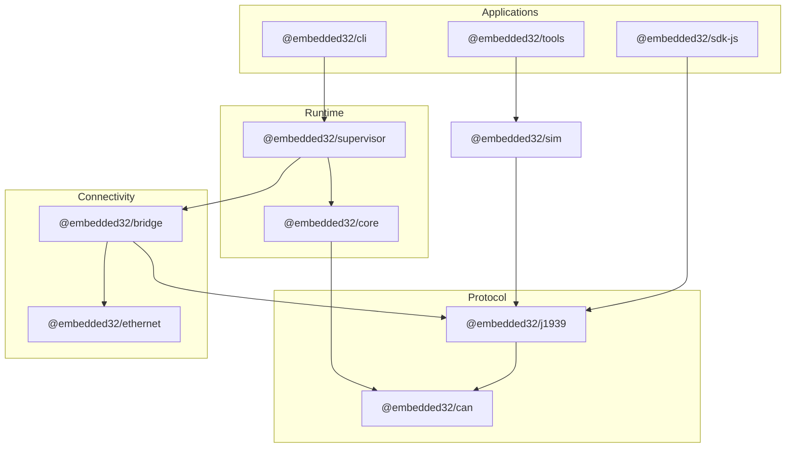

# Embedded32

**An open-source TypeScript platform for learning and experimenting with embedded runtimes, CAN communication, SAE J1939, ECU simulation, diagnostics, and connected vehicle concepts.**

## Current project status

| Area              | Status                                                                                |
| ----------------- | ------------------------------------------------------------------------------------- |
| **Release**       | `v1.0.0` monorepo packages (npm publish requires maintainer approval)                 |
| **Maturity**      | Active development — suitable for learning, labs, and prototyping                     |
| **Testing**       | Core J1939 and runtime libraries have unit tests; some packages have minimal coverage |
| **Documentation** | `apps/site/` Next.js site — run locally; public deploy pending maintainer approval |
| **Certification** | **Not** automotive-certified, safety-certified, or claimed SAE-compliant              |

Embedded32 is a teaching and experimentation platform. It is not positioned as a production-grade replacement for professional CAN tools or a complete J1939 implementation.

## Who Embedded32 is for

- **Students** learning embedded systems, CAN, and vehicle networks without buying hardware first
- **Instructors** building hardware-free or optional-SocketCAN lab modules
- **Developers** prototyping ECU messaging, simulation, and CAN-to-MQTT bridges in TypeScript
- **Contributors** who want a modular npm monorepo to extend with labs, docs, and examples

## What students can learn

- CAN identifiers, frames, payloads, filtering, and logging
- J1939 concepts: PGN, SPN, source address, priority, encoding and decoding (subset)
- Multi-ECU simulation on a shared virtual bus
- Runtime scheduling, modules, and message buses
- Diagnostic messages (DM1/DM2 subset) and fault observation
- Bridging CAN traffic to UDP/TCP/MQTT for connected-systems labs

## Core capabilities

| Capability                                 | Packages                                     |
| ------------------------------------------ | -------------------------------------------- |
| CAN abstraction (mock, virtual, SocketCAN) | `@embedded32/can`                            |
| J1939 parse/decode/transport subset        | `@embedded32/j1939`                          |
| Embedded runtime and scheduler             | `@embedded32/core`, `@embedded32/supervisor` |
| Multi-ECU vehicle simulation               | `@embedded32/sim`                            |
| CAN ↔ Ethernet/MQTT bridging               | `@embedded32/bridge`, `@embedded32/ethernet` |
| CLIs for runtime and tooling               | `@embedded32/cli`, `@embedded32/tools`       |
| JavaScript client SDK                      | `@embedded32/sdk-js`                         |
| Web dashboard (private, dev-only)          | `@embedded32/dashboard`                      |

## Documentation site

Run the Next.js docs site locally after `npm ci` and `npm run docs:api`:

```bash
cd apps/site
npm run dev
```

Open [http://localhost:3000](http://localhost:3000) for guides, labs, packages, and API reference.

The site deploys to **GitHub Pages** via `.github/workflows/deploy-pages.yml`. After the owner enables Pages, it is served at `https://mukesh-scs.github.io/Embedded32/`. See [docs/deployment/GITHUB_PAGES.md](docs/deployment/GITHUB_PAGES.md).

## Browser demo

An interactive, **client-side** CAN/J1939 demo lives at `/demo` on the documentation site (source in `apps/demo/`). It plays synthetic traces and decodes a teaching subset of messages entirely in the browser — no server, WebSocket, or hardware required.

## Fifteen-minute quickstart

No CAN hardware required. From a clean clone:

```bash
git clone https://github.com/Mukesh-SCS/Embedded32.git
cd Embedded32
npm ci
npm run build
```

**1. Decode a J1939 message**

```bash
npx tsx examples/j1939-basic.ts
```

**2. Run a multi-ECU simulation**

```bash
npx embedded32-tools simulate vehicle/basic-truck
```

**3. Use the runtime demo (optional dashboard)**

```bash
npx embedded32 demo
```

See the full walkthrough: [docs/getting-started.md](docs/getting-started.md)

## Package selection

| Goal                    | Start here                                    |
| ----------------------- | --------------------------------------------- |
| Learn CAN basics        | `@embedded32/can`                             |
| Parse/decode J1939      | `@embedded32/j1939`                           |
| Simulate multiple ECUs  | `@embedded32/sim` + `@embedded32/tools`       |
| Build a small runtime   | `@embedded32/core` + `@embedded32/supervisor` |
| Bridge to MQTT/Ethernet | `@embedded32/bridge` + `@embedded32/ethernet` |
| App integration         | `@embedded32/sdk-js`                          |

Full guide: [docs/package-guide.md](docs/package-guide.md)

## Architecture overview



Details: [docs/architecture.md](docs/architecture.md)

## Hardware-free usage

- `MockCANDriver` and `VirtualCANPort` in `@embedded32/can`
- `SimulationRunner` and vehicle profiles in `@embedded32/sim`
- `embedded32-tools simulate` for decoded traffic in the terminal
- Examples under `examples/` and package `examples/` directories
- Future browser demo with prerecorded traces

## Hardware-supported usage

| Platform     | Interface                            | Notes                                                    |
| ------------ | ------------------------------------ | -------------------------------------------------------- |
| Linux / WSL  | SocketCAN (`vcan0`, `can0`)          | Full driver support when `socketcan` module is installed |
| Raspberry Pi | SocketCAN, optional GPIO via `onoff` | Documented in package READMEs                            |
| Windows      | PCAN or gateway                      | Often via bridge/gateway rather than direct SocketCAN    |
| macOS        | Simulation                           | Use mock/virtual paths for development                   |

SocketCAN setup is optional for courses — see [docs/getting-started.md](docs/getting-started.md#optional-socketcan-linux--wsl).

## Educational labs

Four labs are planned under `labs/` (Phase 5):

1. CAN communication basics
2. J1939 messaging
3. Multi-ECU simulation
4. Diagnostics and fault injection

Placeholder index: [labs/README.md](labs/README.md)

## Documentation

| Document                                                                       | Description                                      |
| ------------------------------------------------------------------------------ | ------------------------------------------------ |
| [docs/getting-started.md](docs/getting-started.md)                             | 15-minute hardware-free quickstart               |
| [docs/package-guide.md](docs/package-guide.md)                                 | Which package to install                         |
| [docs/architecture.md](docs/architecture.md)                                   | System architecture                              |
| [docs/concepts/](docs/concepts/)                                               | CAN, J1939, simulation, diagnostics, bridge      |
| [docs/api/](docs/api/)                                                         | Generated TypeDoc reference (`npm run docs:api`) |
| [docs/maintainers/monorepo-workflow.md](docs/maintainers/monorepo-workflow.md) | Build, test, verify commands                     |

## Contributing

Contributions are welcome — documentation, labs, tests, and packaging improvements are especially helpful.

- Read [CONTRIBUTING.md](CONTRIBUTING.md)
- Run `npm run verify` before opening a pull request
- Report bugs via [GitHub Issues](https://github.com/Mukesh-SCS/Embedded32/issues)

## Project roadmap

| Milestone  | Focus                                       | Status on upgrade branch |
| ---------- | ------------------------------------------- | ------------------------ |
| **v1.0.x** | npm reliability, CI, docs, release, citation | Phases 1–13 complete; owner actions for npm/Pages/DOI |
| **v1.1**   | Labs, instructor guides, traces              | Core materials shipped   |
| **v1.2**   | Documentation site and browser demo         | Built; Pages deploy pending owner |
| **v1.3**   | Community pilots and expanded labs          | Planned                  |

Full milestone detail, phase matrix, and owner checklist: [ROADMAP.md](ROADMAP.md) and [docs/maintainers/open-source-upgrade-summary.md](docs/maintainers/open-source-upgrade-summary.md).

## Citation

If you use Embedded32 in academic work, see [docs/citation.md](docs/citation.md).

Machine-readable metadata: [CITATION.cff](CITATION.cff). A Zenodo DOI badge will be added after the first archived release — see [docs/maintainers/zenodo-release.md](docs/maintainers/zenodo-release.md). **Do not cite a DOI until it appears in those files.**

## License

MIT License — see [LICENSE](LICENSE).

## Security reporting

Report vulnerabilities privately — details will be documented in `SECURITY.md` (Phase 6).  
Do not post exploit details in public issues.

## Maintainer information

- **Maintainer:** Mukesh Mani Tripathi
- **Repository:** https://github.com/Mukesh-SCS/Embedded32
- **npm scope:** `@embedded32/*` (publish controlled by maintainers)
