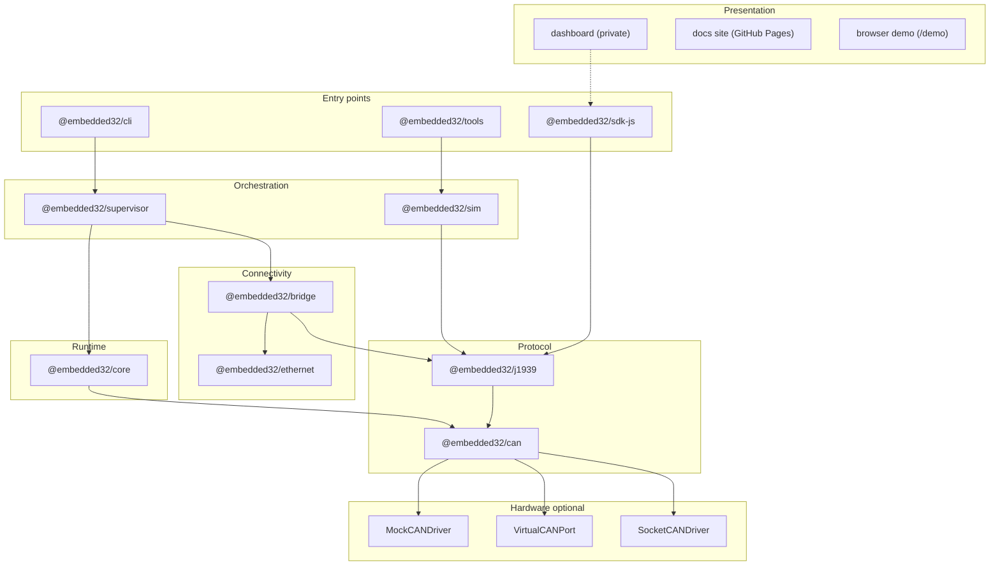
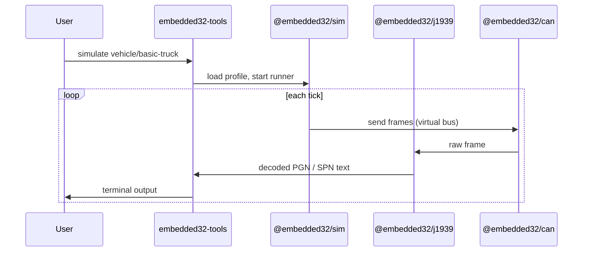
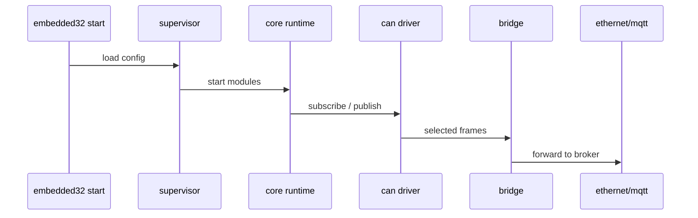

# Architecture

Embedded32 is a **modular npm monorepo** for teaching and prototyping vehicle-network software in TypeScript. Layers are explicit: hardware abstraction, protocol, runtime, simulation, connectivity, and user-facing tools.

## Design principles

1. **Hardware optional** - mock and virtual CAN drivers enable full labs without adapters.
2. **Small public surfaces** - each package exports a focused API; deep imports are discouraged.
3. **Composable pipelines** - CAN → J1939 decode → bridge → MQTT follows clear package boundaries.
4. **Honest scope** - J1939 and diagnostics are **subsets** suitable for education, not full stack certification.

## Layer diagram



## Package responsibilities

| Package                  | Role                            | Key types / commands                               |
| ------------------------ | ------------------------------- | -------------------------------------------------- |
| `@embedded32/can`        | Frame I/O, drivers, filters     | `CANInterface`, `MockCANDriver`, `SocketCANDriver` |
| `@embedded32/j1939`      | ID parsing, PGN catalog, decode | `parseJ1939Id`, `decodeJ1939`, `buildJ1939Id`      |
| `@embedded32/core`       | Scheduler, message bus, modules | `Runtime`, `MessageBus`, `Module`                  |
| `@embedded32/supervisor` | Process-level module supervisor | `Supervisor`, lifecycle hooks                      |
| `@embedded32/sim`        | Multi-ECU profiles and runner   | `SimulationRunner`, vehicle profiles               |
| `@embedded32/bridge`     | Protocol routing                | CAN ↔ UDP/TCP/MQTT bridges                         |
| `@embedded32/ethernet`   | Network transports              | MQTT, UDP, TCP clients                             |
| `@embedded32/cli`        | `embedded32` command            | `demo`, `start`, `init`                            |
| `@embedded32/tools`      | `embedded32-tools` command      | `simulate`, `monitor`, `j1939`                     |
| `@embedded32/sdk-js`     | App-facing SDK                  | `Embedded32Client`, virtual transport              |

## Data flow - simulation lab



## Data flow - runtime with bridge



## Monorepo layout

```
Embedded32/
├── embedded32-can/          # @embedded32/can
├── embedded32-j1939/      # @embedded32/j1939
├── embedded32-core/       # @embedded32/core
├── embedded32-sim/        # @embedded32/sim
├── embedded32-tools/      # @embedded32/tools
├── embedded32-cli/        # @embedded32/cli
├── embedded32-bridge/     # @embedded32/bridge
├── embedded32-ethernet/   # @embedded32/ethernet
├── embedded32-supervisor/ # @embedded32/supervisor
├── embedded32-sdk-js/     # @embedded32/sdk-js
├── embedded32-dashboard/  # private UI
├── examples/              # cross-package examples
├── labs/                  # four classroom labs with starter/solution/rubric
├── docs/                  # human documentation
└── scripts/               # audit, verify, packaging helpers
```

## Build and module formats

| Package             | Module format            | Notes                        |
| ------------------- | ------------------------ | ---------------------------- |
| Most libraries      | ESM (`"type": "module"`) | Node 18+ native ESM          |
| `@embedded32/cli`   | CommonJS                 | `embedded32` bin entry       |
| `@embedded32/tools` | CommonJS                 | `embedded32-tools` bin entry |

Shared TypeScript bases: `tsconfig.base.json`, `tsconfig.node16.json`, `tsconfig.commonjs.json`.

## Extension points

- **New ECU profiles** - add under `embedded32-sim` vehicle definitions; expose via `embedded32-tools simulate`.
- **New PGN decoders** - extend `@embedded32/j1939` catalog and decode tables.
- **New CAN drivers** - implement driver interface in `@embedded32/can`.
- **Labs** - add markdown + starter code under `labs/`.

## What is out of scope (v1.0)

- Full J1939 transport protocol (multi-packet BAM/RTS) for all PGNs
- OBD-II on CAN (separate from J1939 subset)
- Production HIL certification or safety claims
- Published npm scope without maintainer approval

## Related reading

- [Runtime concepts](./concepts/runtime.md)
- [CAN concepts](./concepts/can.md)
- [J1939 concepts](./concepts/j1939.md)
- [Monorepo workflow](./maintainers/monorepo-workflow.md)
