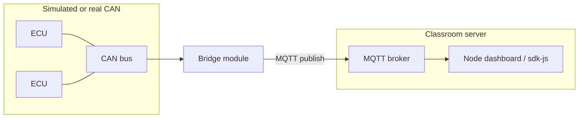
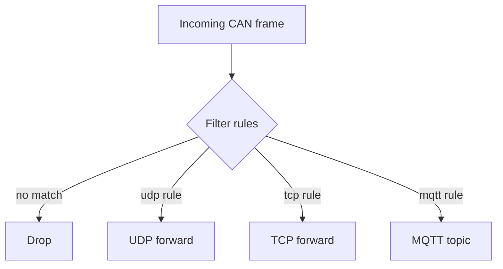

# Bridge concepts

The bridge layer (`@embedded32/bridge`) routes selected CAN/J1939 traffic to IP networks via `@embedded32/ethernet` transports (UDP, TCP, MQTT). This supports **connected vehicle** and **edge gateway** teaching without custom socket code in every lab.

## Gateway pattern



## Selective routing

Not every frame should leave the bus. Bridges typically filter by:

- PGN or ID range
- Source address
- Rate limits (conceptual - check bridge config in supervisor JSON)



## Transports (`@embedded32/ethernet`)

| Transport | Typical lab use                              |
| --------- | -------------------------------------------- |
| UDP       | Low-latency broadcast to classroom listeners |
| TCP       | Single client stream of decoded JSON         |
| MQTT      | Pub/sub for many students / web demo         |

## Supervisor integration

Production-like demos use `@embedded32/supervisor` configuration to load bridge modules alongside CAN and runtime modules:

```bash
npx embedded32 start --config ./config-with-bridge.json
```

Exact schema is documented in package READMEs and will expand in v1.1 labs.

## SDK consumer path

`@embedded32/sdk-js` can consume bridged data through virtual transports for web exercises (see sdk-js examples).

## Security note (classroom)

MQTT labs should use local brokers and TLS where possible. Do not expose unauthenticated bridges to the public internet. See [SECURITY.md](../../SECURITY.md) for credential and deployment guidance.

## Limitations

- No CAN gateway hardware drivers in-tree - use SocketCAN + Linux gateway PC
- Message serialization format may change - pin versions in course materials
- No guaranteed delivery semantics across all transport paths

## See also

- [Architecture](../architecture.md)
- [Runtime concepts](./runtime.md)
- `@embedded32/bridge` and `@embedded32/ethernet` READMEs
