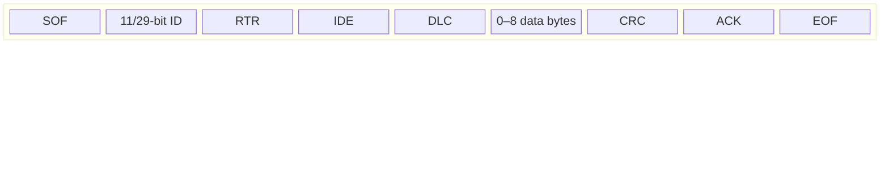
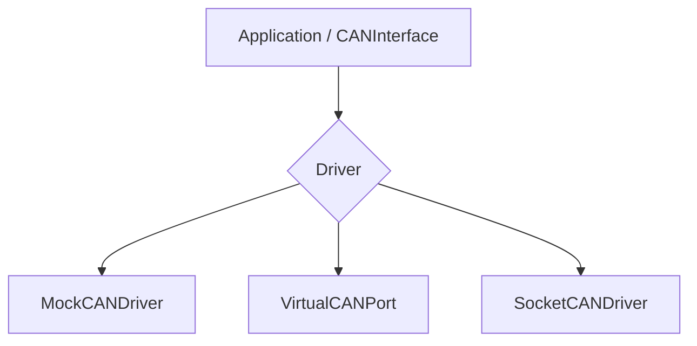
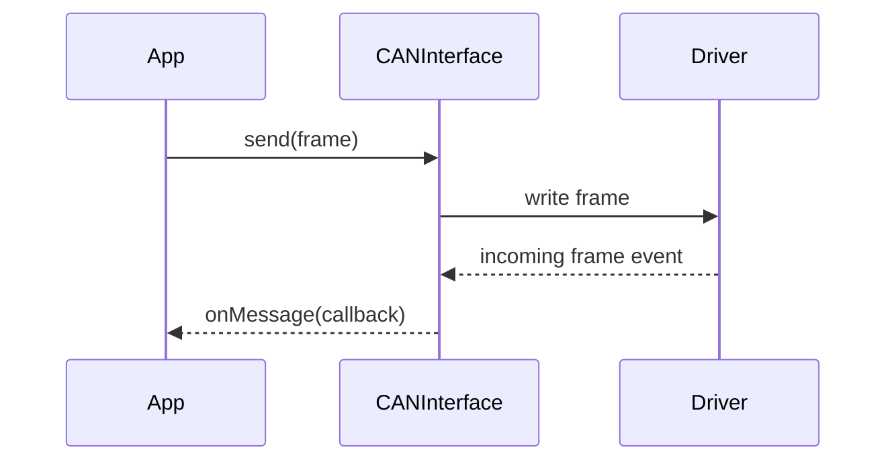

# CAN concepts

Controller Area Network (CAN) is the physical and data-link foundation for J1939 and many embedded labs in Embedded32.

## Frame structure (classic CAN)



Embedded32 works with **logical frames** in TypeScript:

```typescript
interface CANFrame {
  id: number;
  data: number[]; // up to 8 bytes (classic CAN)
  extended?: boolean; // 29-bit ID when true
}
```

## Identifier - standard vs extended

| Type     | ID bits | J1939 usage                   |
| -------- | ------- | ----------------------------- |
| Standard | 11      | Rare in heavy-duty J1939 labs |
| Extended | 29      | **Required** for J1939 on CAN |

J1939 packs priority, PGN, and source address into the 29-bit extended ID. See [J1939 concepts](./j1939.md).

## Driver abstraction



| Driver            | Hardware        | Use case                    |
| ----------------- | --------------- | --------------------------- |
| `MockCANDriver`   | None            | Unit tests, examples        |
| `VirtualCANPort`  | None            | In-memory bus between peers |
| `SocketCANDriver` | Linux SocketCAN | `vcan0`, real adapters      |

## Send and receive flow



## Filtering

`CANInterface` supports acceptance filters so modules only receive relevant IDs - useful when simulating multiple ECUs on one bus.

## Hardware-free learning path

1. Use `MockCANDriver` in `examples/` and package examples.
2. Connect two virtual endpoints with `VirtualCANPort` for bus semantics.
3. Optionally move to `vcan0` on Linux for SocketCAN labs.

## Common student mistakes

- Forgetting `extended: true` for J1939 frames
- Treating `id` as decimal when docs use hex (`0x18F00401`)
- Expecting CAN FD - Embedded32 classic CAN labs use 8-byte payloads

## See also

- [Getting started](../getting-started.md)
- [J1939 concepts](./j1939.md)
- `@embedded32/can` README
