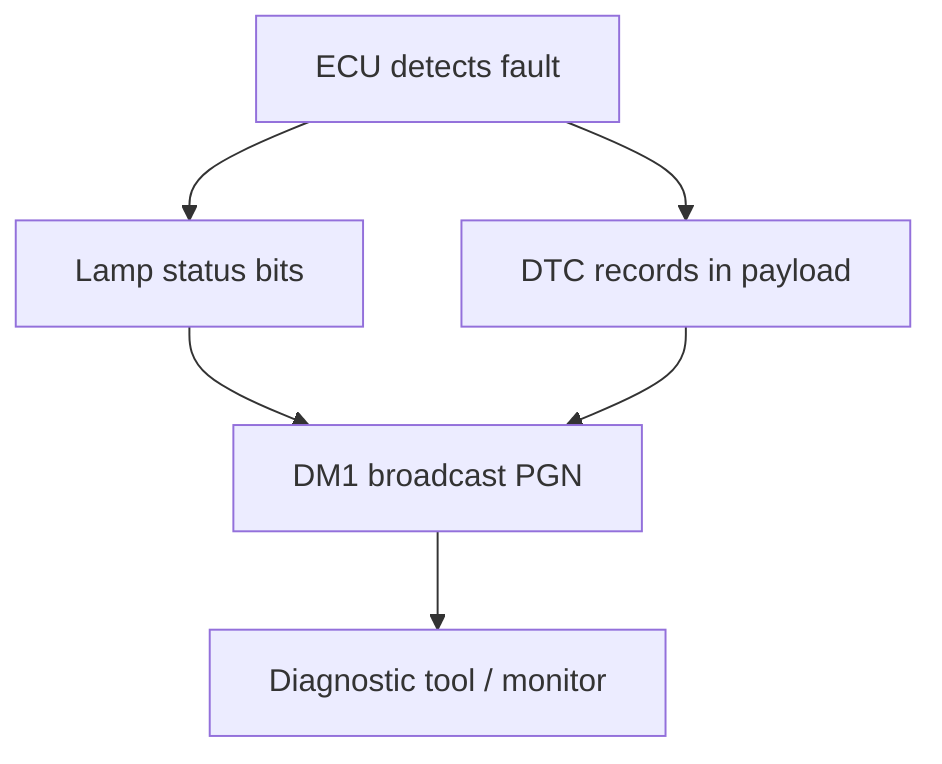
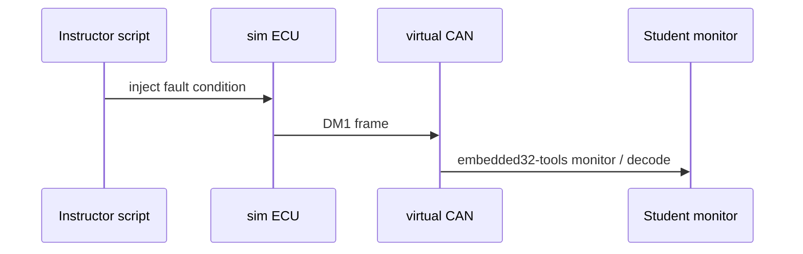

# Diagnostics concepts

Vehicle diagnostics in J1939-heavy networks often use **DM1** (active faults) and **DM2** (previously active) messages. Embedded32 exposes a **subset** for classroom fault observation and injection in simulation - not a full service bay tool chain.

## DM1 mental model



Students learn:

- How faults become broadcast messages
- How a scan tool **listens** without polling every ECU individually
- How lamp status relates to operator warnings

## DTC structure (simplified)

A Diagnostic Trouble Code in J1939 combines:

| Field             | Purpose          |
| ----------------- | ---------------- |
| SPN               | What failed      |
| FMI               | Failure mode     |
| Occurrence count  | How often        |
| Conversion method | Encoding variant |

Embedded32 decode output names fields when the PGN is in the catalog - use simulation labs to correlate hex payloads with text.

## Fault injection in labs



Lab 4 ([`labs/lab-04-diagnostics-and-faults/`](../../labs/lab-04-diagnostics-and-faults/)) walks through inject → observe → clear scenarios.

## DM2 and clearing

**DM2** carries previously active faults. Clearing faults in real ECUs involves legislated workflows; in Embedded32 simulation, clearing is a **state reset** on the simulated ECU for teaching - not a claim of regulatory compliance.

## Relationship to OBD-II

OBD-II on passenger cars uses different PIDs and legislated modes. Embedded32 **does not** position its J1939 diagnostics subset as OBD-II. Courses covering both should label standards explicitly.

## Tools

```bash
# Observe decoded traffic including DM PGNs when present
npx embedded32-tools simulate vehicle/basic-truck

# On Linux with vcan (optional hardware path)
npx embedded32-tools monitor vcan0
```

## Limitations

- Incomplete DTC database
- No UDS/KWP2000 session layer
- No certified scan-tool replacement

## See also

- [J1939 concepts](./j1939.md)
- [ECU simulation](./ecu-simulation.md)
- `@embedded32/j1939` README - PGN catalog section
