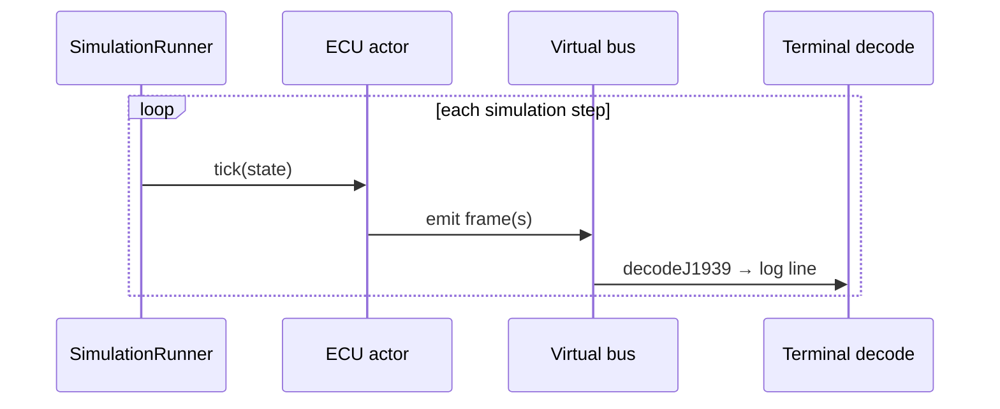
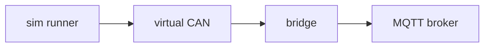

# ECU simulation

Multi-ECU simulation lets students observe a **virtual vehicle network** without wiring harnesses. `@embedded32/sim` provides profiles and a runner; `@embedded32/tools` exposes them via CLI.

## Architecture

```mermaid
flowchart TB
  TOOLS[embedded32-tools simulate]
  RUN[SimulationRunner]
  PROF[Vehicle profile]
  ECU1[Engine ECU]
  ECU2[Transmission ECU]
  ECU3[Diagnostic tool]
  BUS[Virtual CAN bus]
  J1939[@embedded32/j1939 decode]
  TOOLS --> RUN
  RUN --> PROF
  PROF --> ECU1
  PROF --> ECU2
  PROF --> ECU3
  ECU1 --> BUS
  ECU2 --> BUS
  ECU3 --> BUS
  BUS --> J1939
  J1939 --> TOOLS
```

## Basic truck profile

Command:

```bash
npx embedded32-tools simulate vehicle/basic-truck
```

Typical actors:

| Actor            | Role                        | Teaching focus          |
| ---------------- | --------------------------- | ----------------------- |
| Engine ECU       | Torque, speed, temperatures | Periodic broadcast PGNs |
| Transmission ECU | Gear, driveline status      | Multi-node bus traffic  |
| Diagnostic tool  | DM1-style observation       | Diagnostics lab prep    |

## Simulation tick



## Programmatic use

From TypeScript (after `npm run build`):

```typescript
import { SimulationRunner } from '@embedded32/sim';

const runner = new SimulationRunner();
await runner.loadProfile('vehicle/basic-truck');
await runner.start();
// ... observe or hook frames
await runner.stop();
```

Exact API names may vary - see generated [API docs](../api/) or package exports.

## Extending profiles

Instructors can add profiles under the sim package (maintainer workflow):

1. Define ECU actors with periodic transmit lists
2. Register profile id `vehicle/<name>`
3. Document expected PGN output for grading rubrics

## Hardware bridge path

Simulation output can feed a bridge for MQTT/Ethernet labs:



## Limitations

- Simplified vehicle physics - not a full vehicle dynamics model
- Fixed timing - not wall-clock synchronized across machines without bridge
- Profile catalog is small in v1.0 - grows in v1.1 labs

## See also

- [Getting started](../getting-started.md)
- [J1939 concepts](./j1939.md)
- [Diagnostics](./diagnostics.md)
