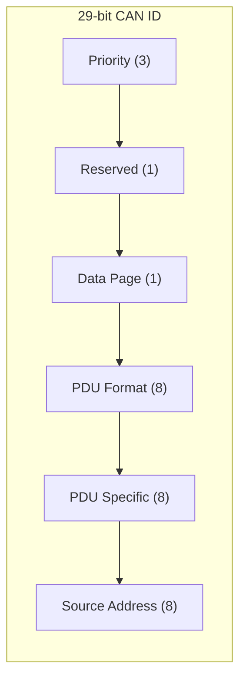
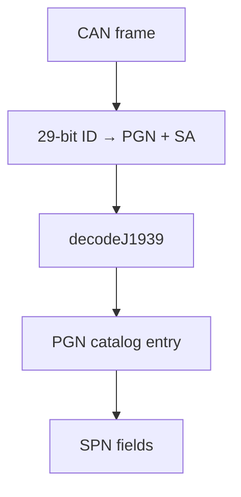

# J1939 concepts

SAE J1939 is a higher-layer protocol on CAN used in commercial vehicles. Embedded32 implements an **educational subset**: ID parsing, common PGN decoding, and simulation-friendly APIs — not a complete certified stack.

## 29-bit identifier layout



Embedded32 exposes this via `parseJ1939Id` and `buildJ1939Id`:

```typescript
import { parseJ1939Id, buildJ1939Id } from '@embedded32/j1939';

const parsed = parseJ1939Id(0x18f00401);
// priority, pgn, sourceAddress, ...

const id = buildJ1939Id({ priority: 6, pgn: 0xf004, sourceAddress: 0x01 });
```

## PGN and SPN

| Term                               | Meaning                                                 |
| ---------------------------------- | ------------------------------------------------------- |
| **PGN** (Parameter Group Number)   | Identifies a message type (e.g. engine speed broadcast) |
| **SPN** (Suspect Parameter Number) | Identifies a field within a PGN payload                 |



Use `decodeJ1939(frame)` for human-readable output and `getPGNInfo(pgn)` for catalog metadata.

## PDU formats (conceptual)

| PDU type | PF range | PS meaning                        |
| -------- | -------- | --------------------------------- |
| PDU1     | 0–239    | Destination address               |
| PDU2     | 240–255  | Group extension (broadcast-style) |

Labs focus on common broadcast PGNs (PDU2-style) found in the basic truck profile.

## Encode vs decode

- **Decode** — given a received frame, extract SPN values (implemented for catalog PGNs).
- **Encode** — build payload bytes from logical values (partial — check package API for supported PGNs).

Always set `extended: true` on the CAN frame when exercising J1939.

## Example walkthrough

```typescript
import { MockCANDriver, CANInterface } from '@embedded32/can';
import { decodeJ1939, parseJ1939Id } from '@embedded32/j1939';

const can = new CANInterface(new MockCANDriver());
can.onMessage((frame) => {
  const msg = decodeJ1939(frame);
  console.log(msg.name, msg.signals);
});

const id = 0x18fef100; // example cruise/speed-related broadcast
can.send({ id, data: [0x40, 0x1f, 0, 0, 0, 0, 0, 0], extended: true });
console.log(parseJ1939Id(id));
```

Run the full example: `npx tsx examples/j1939-basic.ts`

## Transport protocol (scope note)

Full J1939 uses **Transport Protocol** (BAM, RTS/CTS) for multi-packet messages. Embedded32 v1.0 documents this conceptually but does not claim full transport coverage for all PGNs. Single-frame PGNs are the primary lab focus.

## Address claiming

J1939 nodes claim source addresses on the bus. Simulation profiles assign fixed addresses (e.g. engine `0x00`, transmission `0x03`) for predictable classroom output.

## Honest limitations

- PGN catalog is **partial** — enough for labs, not exhaustive
- No compliance testing against SAE conformance suites
- Bit-packed SPN scaling follows simplified rules in places — verify against SAE PDFs for research work

## See also

- [CAN concepts](./can.md)
- [ECU simulation](./ecu-simulation.md)
- [Diagnostics](./diagnostics.md)
- `@embedded32/j1939` README
