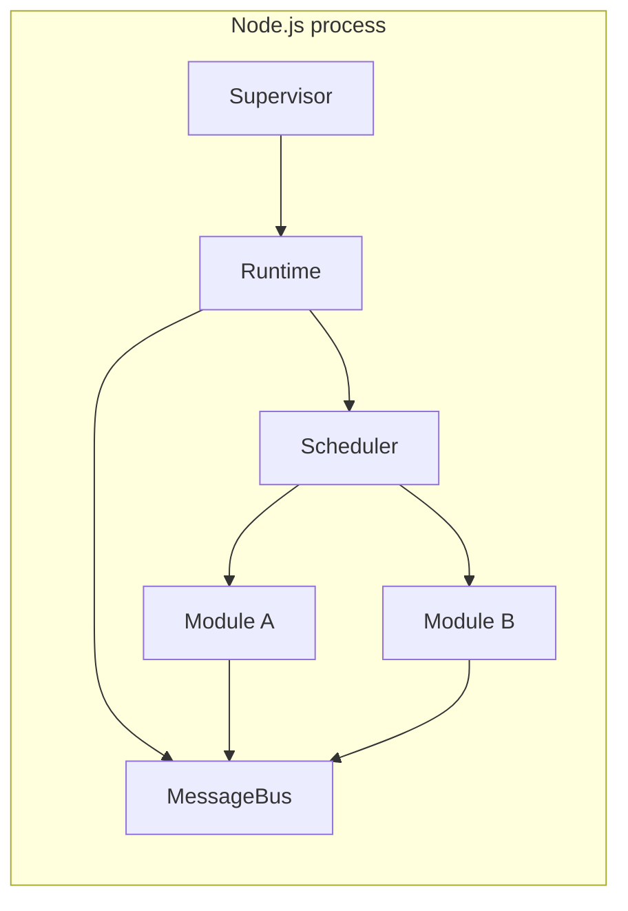
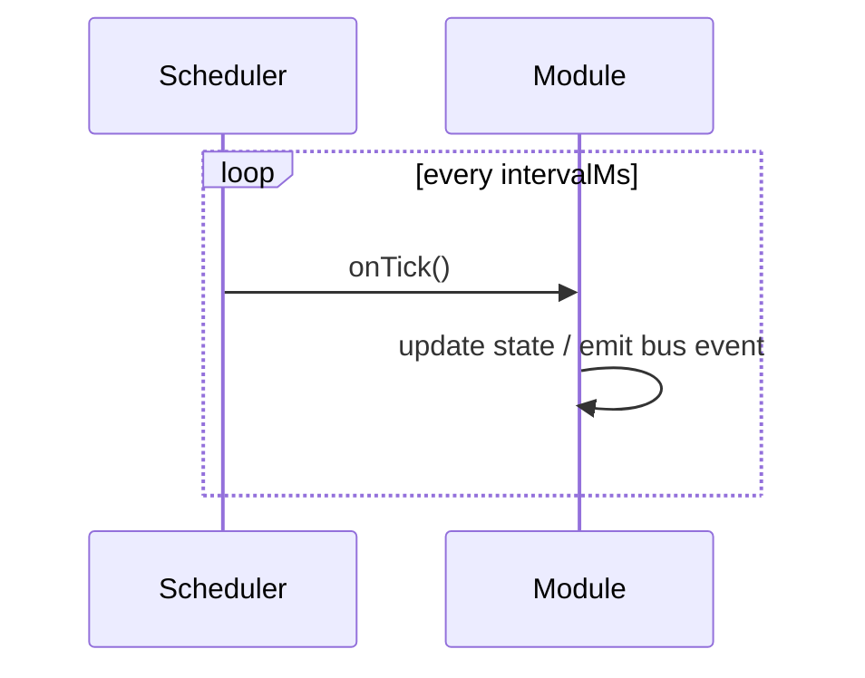
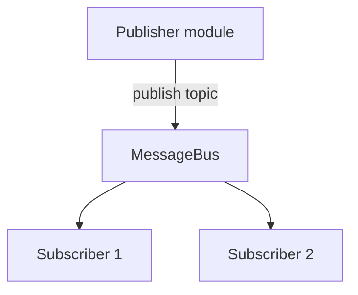

# Runtime concepts

The Embedded32 runtime layer (`@embedded32/core`, `@embedded32/supervisor`) models a small embedded application: periodic tasks, a message bus, and pluggable modules supervised at process level.

## Mental model



- **Runtime** — owns the scheduler and message bus; wires modules together.
- **Module** — unit of logic with `init`, `start`, `stop`, and optional tick handlers.
- **MessageBus** — in-process pub/sub for typed or string topics.
- **Supervisor** — loads configuration, starts/stops modules, integrates CAN/bridge modules.

## Scheduler

The scheduler runs registered callbacks on a fixed interval (milliseconds). Typical uses:

- Poll sensors or simulated ECU state
- Emit heartbeat messages
- Drive simulation ticks



## Message bus

Modules communicate without direct references:



This mirrors ECU-internal event routing and keeps lab code decoupled.

## Supervisor and CLI

`@embedded32/cli` is the primary entry for running a configured stack:

```bash
npx embedded32 demo
npx embedded32 start --config ./my-config.json
```

The supervisor reads JSON configuration (modules, CAN interfaces, bridge endpoints) and coordinates lifecycle: initialize → start → graceful shutdown on `SIGINT`.

## When to use core vs sim vs tools

| Need                              | Package                                      |
| --------------------------------- | -------------------------------------------- |
| Custom app with your own modules  | `@embedded32/core`                           |
| Pre-built vehicle ECU actors      | `@embedded32/sim`                            |
| Terminal lab without writing code | `@embedded32/tools`                          |
| Production-like process layout    | `@embedded32/supervisor` + `@embedded32/cli` |

## Limitations (educational scope)

- Single-process Node.js — not a real RTOS or AUTOSAR runtime
- No hard real-time guarantees
- Configuration format may evolve before v1.1

## See also

- [Architecture](../architecture.md)
- [ECU simulation](./ecu-simulation.md)
- `@embedded32/core` package README
