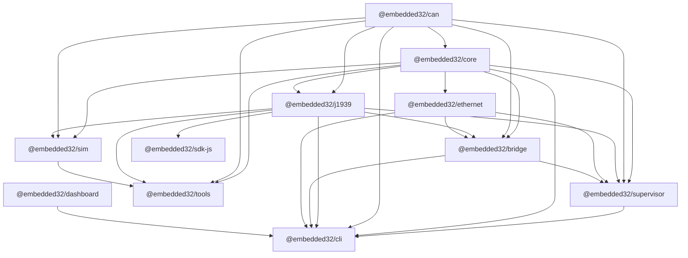

# Repository Audit

Phase 1 inventory for the Embedded32 monorepo. No structural refactoring was performed to produce this document.

**Audit date:** 2026-07-04  
**Branch:** `feat/open-source-education-platform`  
**Repository:** [Mukesh-SCS/Embedded32](https://github.com/Mukesh-SCS/Embedded32)

---

## Executive summary

Embedded32 is an npm workspaces + Lerna monorepo with **13 workspace packages** (10 public npm packages, 3 private). The platform covers embedded runtime, CAN/J1939 protocol stacks, simulation, bridging, CLIs, SDKs, and a React dashboard.

**Strengths today**

- TypeScript packages compile successfully from root `npm run build`
- Core J1939 and runtime libraries have meaningful Jest coverage
- Public packages ship compiled `dist/` JavaScript and `.d.ts` files when built first
- Virtual CAN and mock drivers enable hardware-free development

**Known gaps (pre-existing)**

- `npm ci` fails due to lockfile drift
- No `prepack` scripts; LICENSE omitted from tarballs
- Duplicate `embedded32` CLI binary in two packages
- Workspace `*` internal dependencies will not resolve on npm after publish
- Several packages use placeholder tests (`echo "no tests yet"`)
- No GitHub Actions CI, ESLint, or shared TypeScript base config
- `@embedded32/dashboard` is workspace-only and excluded from Lerna

---

## Monorepo configuration

| Tool | File | Notes |
|------|------|-------|
| npm workspaces | Root `package.json` `workspaces` | 13 package paths |
| Lerna | `lerna.json` | 12 packages (excludes `embedded32-dashboard`) |
| Versioning | Lerna fixed `1.0.0` | All packages share version `1.0.0` |
| Release script | `npm run publish-packages` | `lerna publish --yes` — not run during audit |
| Lockfile | `package-lock.json` | Out of sync with `package.json` (blocks `npm ci`) |

### Root scripts

| Script | Command | Purpose |
|--------|---------|---------|
| `build` | `lerna run build` | Build all Lerna packages |
| `test` | `lerna run test` | Test all Lerna packages |
| `clean` | `lerna run clean` | Per-package clean |
| `bootstrap` | `lerna bootstrap` | Legacy bootstrap |
| `publish-packages` | `lerna publish --yes` | Publish to npm |
| `audit:packages` | `node scripts/audit-packages.mjs` | Packaging audit (Phase 1) |

---

## Directory map

```
Embedded32/
├── package.json              # Private root workspace
├── lerna.json
├── LICENSE                   # MIT (root only; not copied into package tarballs)
├── README.md
├── CONTRIBUTING.md
├── docs/                     # Existing documentation (partial)
├── examples/                 # Root-level examples
├── scripts/                  # Maintainer scripts (audit-packages.mjs)
├── embedded32-core/          # Runtime, scheduler, modules
├── embedded32-can/           # CAN abstraction
├── embedded32-j1939/         # J1939 stack
├── embedded32-ethernet/      # UDP/TCP/MQTT
├── embedded32-bridge/        # CAN ↔ Ethernet/MQTT routing
├── embedded32-sim/           # Vehicle / ECU simulation
├── embedded32-supervisor/    # Module lifecycle supervisor
├── embedded32-cli/           # Runtime CLI (bin: embedded32)
├── embedded32-tools/         # Monitoring CLI tools (bin: embedded32 — conflict)
├── embedded32-dashboard/     # React/Vite dashboard (private)
├── embedded32-sdk-js/        # JavaScript client SDK
├── embedded32-sdk-c/         # C SDK sources (private)
└── embedded32-sdk-python/    # Python SDK (private)
```

### Source layout (typical TypeScript package)

| Path | Purpose |
|------|---------|
| `src/` | TypeScript source |
| `dist/` | Compiled output (after `npm run build`) |
| `tests/` | Jest tests (where present) |
| `examples/` | Runnable examples (several packages) |

### Build outputs

| Package | Output directory | Format |
|---------|------------------|--------|
| TypeScript libs | `dist/` | ESM or CJS per package `type` |
| `@embedded32/dashboard` | `dist/` (Vite) | Browser bundle — not built by root `npm run build` |
| `@embedded32/sdk-c` | N/A (C sources) | CMake/make expected |
| `@embedded32/sdk-python` | N/A | Python package under `src/embedded32/` |

### Test directories

| Package | Test path | Runner |
|---------|-----------|--------|
| `embedded32-core` | `tests/` | Jest |
| `embedded32-can` | `tests/can.test.ts` | **Not wired** (script echoes stub) |
| `embedded32-j1939` | `tests/` | Jest (45 tests) |
| `embedded32-ethernet` | `tests/` | Jest |
| `embedded32-bridge` | `tests/` | Jest (minimal) |
| `embedded32-sim` | `tests/` | Jest (minimal) |
| `embedded32-supervisor` | `tests/` | Jest (minimal) |
| `embedded32-cli` | `tests/` | Jest (minimal) |
| `embedded32-tools` | `tests/tools.test.ts` | **Not wired** (script echoes stub) |
| `embedded32-sdk-js` | `tests/` | Jest |
| `embedded32-sdk-python` | `tests/test_sdk.py` | pytest (not run from npm test) |

### Examples

| Location | Contents |
|----------|----------|
| `examples/` | Root J1939 and canonical cross-language examples |
| `embedded32-can/examples/` | Mock CAN, SocketCAN demo, custom driver |
| `embedded32-core/examples/` | Runtime and module demos |
| `embedded32-j1939/examples/` | Parse, monitor, send, engine sim |
| `embedded32-sim/examples/` | Multi-ECU demo |
| `embedded32-sdk-js/examples/` | J1939 and CAN client demos |
| `embedded32-sdk-c/examples/` | C engine monitor |
| `embedded32-sdk-python/examples/` | Python engine monitor |

### Documentation (existing)

| Path | Topic |
|------|-------|
| `README.md` | Platform overview, CLI quick start |
| `CONTRIBUTING.md` | Contributor guide |
| `docs/README.md` | Docs index |
| `docs/J1939_QUICKSTART.md` | J1939 quick start |
| `docs/J1939_ARCHITECTURE.md` | Architecture notes |
| `docs/getting-started.md` | Getting started |
| `docs/tutorials/first-run.md` | First run tutorial |
| Per-package `README.md` | Package-specific docs (17 files) |

---

## Executables and CLIs

| Package | Binary name | Entry file | Notes |
|---------|-------------|------------|-------|
| `@embedded32/cli` | `embedded32` | `dist/cli.js` | Runtime supervisor CLI; shebang present |
| `@embedded32/tools` | `embedded32` | `dist/cli.js` | Phase 2 monitoring tools CLI; **name collision** |

Installing both packages globally would conflict on the `embedded32` command.

---

## Runtime classification

### Node.js-only modules

| Package | Reason |
|---------|--------|
| `@embedded32/core` | Scheduler, filesystem config, optional GPIO |
| `@embedded32/can` | SocketCAN driver (optional native `socketcan`) |
| `@embedded32/j1939` | Built on CAN port; Node-oriented examples |
| `@embedded32/ethernet` | `net`, MQTT client |
| `@embedded32/bridge` | Node networking and routing |
| `@embedded32/sim` | ECU simulation orchestration |
| `@embedded32/supervisor` | YAML config, module loader |
| `@embedded32/cli`, `@embedded32/tools` | Node CLIs |
| `@embedded32/sdk-js` | Node client (virtual transport default) |

### Browser-compatible modules (partial or with bundling)

| Package / area | Browser suitability |
|----------------|---------------------|
| `@embedded32/dashboard` | **Primary browser target** — React + Vite SPA |
| `@embedded32/j1939` decode logic | Usable in browser if bundled without Node APIs |
| `@embedded32/can` `MockCANDriver`, `VirtualCANPort` | Simulation suitable for browser demos |
| `@embedded32/sdk-js` | Virtual transport path; SocketCAN path is Node-only |

### Native / hardware-dependent modules

| Component | Package | Dependency | Platform |
|-----------|---------|------------|----------|
| `SocketCANDriver` | `@embedded32/can` | optional `socketcan` npm (native) | Linux / WSL |
| `RaspberryPiLEDModule` | `@embedded32/core` | optional `onoff` (GPIO native) | Raspberry Pi |
| C SDK | `@embedded32/sdk-c` | SocketCAN (platform C API) | Linux embedded targets |

---

## Package inventory

| Package | Purpose | Entry point | Public or private | Runtime environment | Internal dependencies | External dependencies | Build command | Test command | Published on npm | Current packaging status | Known problems |
|---------|---------|-------------|-----------------|---------------------|----------------------|----------------------|---------------|--------------|------------------|-------------------------|----------------|
| `@embedded32/core` | Lightweight OS runtime: scheduler, messaging, module registry, plugins | `dist/index.js` | Public | Node.js ≥18 | `@embedded32/can@1.0.0` | optional `onoff` | `tsc -p tsconfig.json` | `jest` | Intended (`publishConfig.public`) | dist + d.ts present; README in tarball | LICENSE not in tarball; no prepack; no engines field |
| `@embedded32/can` | CAN bus abstraction: mock, virtual, SocketCAN drivers | `dist/index.js` | Public | Node.js (SocketCAN: Linux) | — | optional `socketcan` (not declared) | `tsc -p tsconfig.json` | `echo "no tests yet"` | Intended | dist + d.ts present | Tests exist but not run; LICENSE missing; SocketCAN optional dep undeclared |
| `@embedded32/j1939` | SAE J1939 subset: PGN/SPN, DM1, transport protocol, gateway | `dist/index.js` | Public | Node.js ≥16 | `@embedded32/can@1.0.0` | — | `tsc -p tsconfig.json` | `jest` | Intended | dist + d.ts; strongest test coverage | LICENSE missing; description overstates "Professional" compliance; `.npmignore` shipped in tarball |
| `@embedded32/sim` | Vehicle / multi-ECU simulation | `dist/index.js` | Public | Node.js | `core`, `can`, `j1939` @1.0.0 | — | `tsc -p tsconfig.json` | `npx jest --passWithNoTests` | Intended | dist + d.ts + vehicle profiles | LICENSE missing; minimal tests; no author keywords |
| `@embedded32/ethernet` | UDP, TCP, MQTT, NanoProto serialization | `dist/index.js` | Public | Node.js | `@embedded32/core:*` | `mqtt@^5` | `tsc` | `jest` | Intended | CJS dist + d.ts | Wildcard dep; LICENSE missing; no sideEffects |
| `@embedded32/bridge` | CAN ↔ Ethernet ↔ MQTT routing | `dist/index.js` | Public | Node.js | `core`, `can`, `j1939`, `ethernet` (all `*`) | — | `tsc` | `jest` (minimal) | Intended | CJS dist + d.ts | Wildcard deps; LICENSE missing; placeholder tests |
| `@embedded32/supervisor` | Runtime supervisor and module lifecycle | `dist/index.js` | Public | Node.js | `core`, `can`, `j1939`, `ethernet`, `bridge` (`*`) | `yaml`, `ts-node` (prod) | `tsc` | `jest` (minimal) | Intended | CJS dist + d.ts | `ts-node` should be devDep; wildcard deps; LICENSE missing |
| `@embedded32/tools` | CLI monitoring: J1939 monitor/send, CAN setup, simulation | `dist/cli.js` (bin: `embedded32`) | Public | Node.js | `can`, `core`, `j1939`, `sim` (`*`) | `commander`, `ws` | `tsc -p tsconfig.json` | `echo "no tests yet"` | Intended | dist + d.ts; bin packaged | **Duplicate bin name**; tests not wired; LICENSE missing; wildcard deps |
| `@embedded32/cli` | Runtime launcher CLI: init, start, demo, plugins | `dist/index.js` / bin `dist/cli.js` | Public | Node.js | `can`, `core`, `j1939`, `supervisor`, `bridge`, `dashboard`, `ethernet` (`*`) | `chalk`, `commander`, `ws`, `yaml` | `tsc` | `jest` (minimal) | Intended | bin + dist packaged | **Depends on private `@embedded32/dashboard`**; no `types` field; duplicate bin; LICENSE missing |
| `@embedded32/sdk-js` | High-level JS client for J1939/CAN | `dist/index.js` (+ `exports` map) | Public | Node.js (virtual transport) | `@embedded32/j1939:*` | — | `tsc` | `npx jest --passWithNoTests` | Intended | Best metadata (`exports` map) | Wildcard dep; LICENSE missing |
| `@embedded32/dashboard` | React web dashboard for CAN/J1939 monitoring | Vite app (`src/main.tsx`) | **Private** | Browser | `react`, `react-dom`, `recharts` | — | `tsc && vite build` | `jest` | No (`private: true`) | Not built by Lerna; no dist after root build | Not publishable; referenced as dep of `@embedded32/cli` |
| `@embedded32/sdk-c` | C/C++ J1939 client library | C headers (`include/`) | **Private** | Embedded C / Linux | — | SocketCAN (platform) | echo stub | echo stub | No (`private: true`) | Source-only npm meta package | Wrong repo URL; no npm build |
| `@embedded32/sdk-python` | Python J1939 client | `src/embedded32/` | **Private** | Python ≥3.8 | — | — | none | echo / `pytest` optional | No (`private: true`) | PyPI not configured | Wrong repo URL; npm test is stub |
| `embedded32` (root) | Private monorepo workspace root | — | **Private** | Node.js tooling | all workspaces | `lerna`, `typescript`, `jest`, `vite` | `lerna run build` | `lerna run test` | No | Meta package only | `npm ci` broken; no lint/typecheck/verify scripts |

---

## Package dependency graph (internal)



---

## npm publishing configuration

| Aspect | Current state |
|--------|---------------|
| Scope | `@embedded32/*` |
| Access | `publishConfig.access: "public"` on publishable packages |
| Version | Fixed `1.0.0` across Lerna packages |
| `files` field | Most packages: `["dist"]` only — excludes LICENSE |
| `prepack` | **Not configured** on any package |
| `exports` map | Only `@embedded32/sdk-js` |
| Provenance / trusted publishing | Not configured |
| Changesets | Not present |

---

## Packaging audit automation

Run from repository root:

```bash
npm run audit:packages
```

The script (`scripts/audit-packages.mjs`) builds each public package, runs `npm pack --dry-run`, and verifies entry points, JS, declarations, README, LICENSE, and bin configuration.

**Expected Phase 1 result:** failures for missing LICENSE in tarballs and duplicate `embedded32` bin; warnings for missing `prepack`, wildcard deps, and missing `types` on `@embedded32/cli`.

---

## Repository owner actions (not blocking Phase 1)

- Repair `package-lock.json` so `npm ci` succeeds in CI
- Decide canonical CLI package (`@embedded32/cli` vs `@embedded32/tools`) before npm publish
- Confirm npm scope ownership for `@embedded32`
- Enable GitHub Issues, Discussions, and branch protection (Phase 6–7)

---

## Phase 1 acceptance checklist

| Criterion | Status |
|-----------|--------|
| Repository inventory exists | ✅ This document |
| Baseline build/test documented | ✅ `baseline-status.md` |
| Every public package audited | ✅ Manual dry-run + `audit-packages.mjs` |
| No structural refactoring | ✅ Audit-only changes |
| Packaging failures identified | ✅ See table and audit script output |
| Phase 1 summary provided | ✅ See commit message / PR description |
